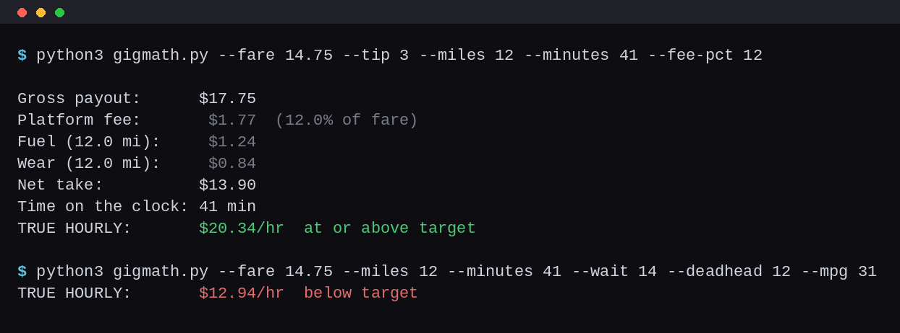

# Side Hustle Scripts

A grab-bag of small tools for people running side hustles: gig-app math,
client-finder utilities, and payout trackers. Standard library only:
no install, no dependencies.



## What is in here

- `gigmath.py` - true hourly pay for driving/gig work after platform fees,
  gas, and wear. Counts unpaid deadhead miles and wait minutes; exits 1
  when the gig lands below your target rate, so it works in scripts.
- `client-emails.py` - cost-ranked list of ways to find + verify client
  emails before cold outreach (coming next).
- `payout-audit.py` - feeds your payout history in, flags hidden fees and
  underpriced hours (coming next).

## Usage

```
$ python3 gigmath.py --fare 14.75 --tip 3 --miles 12 --minutes 41 --fee-pct 12
Gross payout:          $17.75
Platform fee:           $1.77  (12.0% of fare)
Fuel (12.0 mi):         $1.24
Wear (12.0 mi):         $0.84
Net take:              $13.90
Time on the clock:     41 min
TRUE HOURLY:        $20.34/hr  at or above target

$ python3 gigmath.py --fare 14.75 --tip 3 --miles 12 --minutes 41 --fee-pct 12 --wait 14 --deadhead 12 --gas-price 3.15 --mpg 31
TRUE HOURLY:        $12.94/hr  below target

$ python3 gigmath.py --fare 14.75 --tip 3 --miles 12 --minutes 41 --fee-pct 12 --json
```

## The math

Net = fare + tip + promo, minus the platform fee (percent of fare), minus
fuel ((paid + deadhead miles) / mpg x gas price), minus wear (miles x
per-mile cost). Hours = drive minutes + unpaid wait minutes. The output
rate is net / hours: the number that actually reaches your pocket per
hour of clock time, not the app's per-trip headline.

A rate calculator is the easy part; picking gigs worth your evenings is
the real work. For side-hustle breakdowns with real numbers, effective
hourly math, and practical guides, see
[ExtraHustles](https://extrahustles.com/) - side hustles and extra money,
done practically.

## License

MIT
